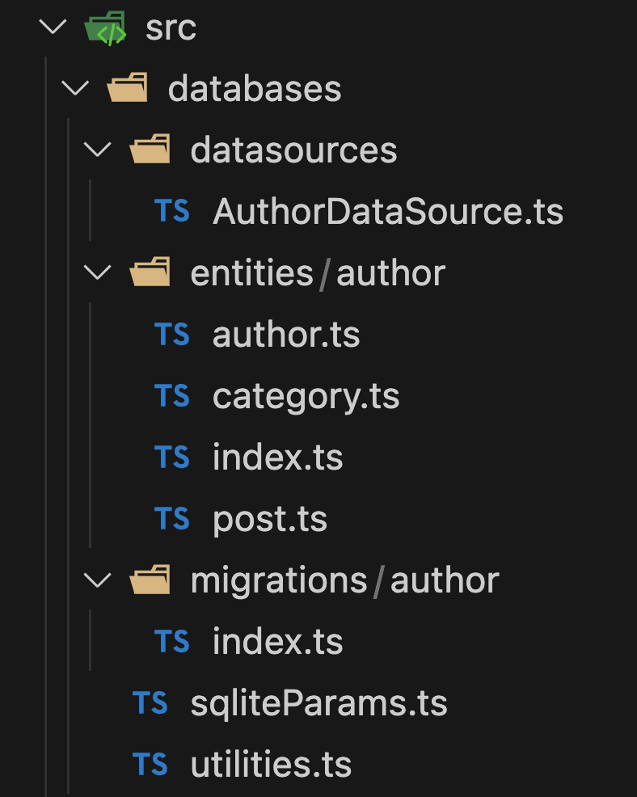

# Using TypeORM with the capacitor driver type

## Some Basics

 - Developers can use the `@capacitor-community/sqlite` plugin to create apps for Web, Electron, iOS, or Android using the same code. Almost any framework can be used to develop these apps:

    - Ionic7/Angular, Ionic7/React, Ionic7/Vue 
    - Pure Angular, React, Vue3
    - SolidJS
    - Quasar
    - Nuxt3 + Kysely
    - Svelte

 - The `typeOrm` package now has a `capacitor` driver type that must be used with the `@capacitor-community/sqlite` capacitor plugin.

 - Apps using the `@capacitor-community/sqlite` capacitor plugin cannot use the `CLI` of the `typeOrm` package. Developers trying to do so, will receive a message stating that the "jeep-sqlite element is not present in the DOM". The Web part of the plugin needs the DOM to create and store the database. 

 - In release 5.6.0, I attempted to propose a workaround by utilizing certain Node.js packages like 'fs', 'os', and 'path' to facilitate the generation of initial and subsequent migration files. While this workaround worked smoothly on some frameworks using Vite (such as React and Svelte), unfortunately, I encountered difficulties with Angular due to the inability to find a suitable method for building the app.

 - In release 5.6.1.1, I decided to retract the proposal for the workaround and refrain from implementing it. As a consequence, migration files will need to be created manually.


## Applications/Tutorials

Applications will come on a regular basis 

 - [Applications Github](https://github.com/jepiqueau/blog-tutorials-apps)
 - [Tutorials site](https://jepiqueau.github.io/)

## Typical TypeOrm App Directory Structure

In the context of an Author DataSource with three entities
 - Author
 - Category
 - Post

the TypeOrm directory structure could be organized as follows, irrespective of the framework used:





## Putting Some Code Into Those Files

### DataSource AuthorDataSource.ts

```ts
import { DataSource , type DataSourceOptions} from 'typeorm';
import sqliteParams from '../sqliteParams';
import * as entities from '../entities/author';
import * as migrations from '../migrations/author';

const dbName = "YOUR_DATABASE_NAME";

const dataSourceConfig: DataSourceOptions = {
  name: 'authorConnection',
  type: 'capacitor',
  driver: sqliteParams.connection,
  database: dbName,
  mode: 'no-encryption',
  entities: entities,
  migrations: migrations, //["../migrations/author/*{.ts,.js}"]
  subscribers: [],
  logging: [/*'query',*/ 'error','schema'],
  synchronize: false,     // !!!You will lose all data in database if set to `true`
  migrationsRun: false  // Required with capacitor type
};
export const dataSourceAuthor = new DataSource(dataSourceConfig);
const authorDataSource = {
  dataSource: dataSourceAuthor,
  dbName: dbName
};

export default authorDataSource;
```

### Entity author.ts

```ts
import {Entity, PrimaryGeneratedColumn, Column, OneToMany, CreateDateColumn} from 'typeorm';
import {Post} from './post';

@Entity('author')
export class Author {

  @PrimaryGeneratedColumn()
  id!: number;

  @Column()
  name!: string;

  @Column({nullable: true})
  birthday!: string;

  @Column({unique: true})
  email!: string;

  @OneToMany(type => Post, post => post.author)
  posts!: Post[];
  
}
```

### Entity category.ts

```ts
import {Entity, PrimaryGeneratedColumn, Column} from 'typeorm';

@Entity('category')
export class Category {

    @PrimaryGeneratedColumn()
    id!: number;

    @Column({unique: true})
    name!: string;

}
```

### Entity post.ts

```ts
import {Entity, Column, PrimaryGeneratedColumn, ManyToOne, ManyToMany,
		JoinTable, type Relation, CreateDateColumn} from 'typeorm';
import {Author} from './author';
import {Category} from './category';

@Entity('post')
export class Post {
  @PrimaryGeneratedColumn()
  id!: number;

  @Column()
  title!: string;

  @Column('text')
  text!: string;

  @ManyToMany(type => Category, {
		cascade: ['insert']
	})
	@JoinTable()
	categories!: Category[];

	@ManyToOne(type => Author, author => author.posts, {
		cascade: ['insert']
	})
	author!: Relation<Author>;

}
```

### Entity index.ts

```ts
import { Author } from './author';
import { Category } from './category';
import { Post } from './post';

export { Author, Category, Post };
```

### Migration index.ts

```ts
export {};
```

### Capacitor sqliteParams.ts

```ts
import { Capacitor } from '@capacitor/core';
import { CapacitorSQLite, SQLiteConnection } from '@capacitor-community/sqlite';
const sqliteConnection: SQLiteConnection = new SQLiteConnection(CapacitorSQLite);
const sqlitePlugin = CapacitorSQLite;
const platform: string = Capacitor.getPlatform();
const sqliteParams = {
    connection: sqliteConnection,
    plugin: sqlitePlugin,
    platform: platform
}
export default sqliteParams;
```

### Utilities utilities.ts

```ts
import { DataSource } from "typeorm";

export const getCountOfElements =  (async (connection: DataSource, entity:any): Promise<number> => {
    // Get the repository for your entity
    const repository = connection.getRepository(entity);
    // Use the count() method to query the count of elements in the table
    const count = await repository.count();
  
    return count;
});
```

## Correcting a Bug in the TypeOrm Capacitor Driver

 - the bug is referenced "PRAGMA must run under query method in Capacitor sqlite #10687" in the typeorm/issues and it is for `typeorm release > 3.0.18`.

 - create a `scripts` directory at the root of the App.

 - create a `modify-typeorm.cjs`/`modify-typeorm.js (for ESModule)` file under this directory with:

 ```js
const fs = require('fs');
// For ESModule:
// import fs from 'fs';

/* Modify CapacitorQueryRunner.js */
const correctBugInCapacitorQueryRunner = (file) => {
  if (fs.existsSync(file)) {
    fs.readFile(file, 'utf8', function (err, data) {
      if (err) {
        return console.error(err);
      }

      // This key helps to identify that this file has been modified by this script
      const isModifiedKey = "/** correctBugInCapacitorQueryRunner */";
      const isModifiedIndex = data.indexOf(isModifiedKey);

      if (isModifiedIndex !== -1) {
        console.warn(`${isModifiedKey} found. Package probably fixed.`);
        return;
      }

      const index = data.indexOf(`"DROP",`)
      if (index === -1) {
        console.warn('Line not found. Package probably fixed.');
        return;
      }

      var result = data.replace(
        `    "DROP",`,
        `    "DROP",
        "PRAGMA"`

      );
      result = result.replace(
        'else if (["INSERT", "UPDATE", "DELETE", "PRAGMA"].indexOf(command) !== -1) {',
        'else if (["INSERT", "UPDATE", "DELETE"].indexOf(command) !== -1) {'
      );

      result += isModifiedKey;

      fs.writeFile(file, result, 'utf8', function (err) {
        if (err) return console.error(err);
      });
    });
  } else {
    utils.warn(`Couldn't find file ${file}`);
  }

}
/* Moddify CapacitorDriver.js */
const correctBugInCapacitorDriver = (file) => {
  if (fs.existsSync(file)) {
    fs.readFile(file, 'utf8', function (err, data) {
      if (err) {
        return console.error(err);
      }

      // This key helps to identify that this file has been modified by this script
      const isModifiedKey = "/** correctBugInCapacitorDriver */";
      const isModifiedIndex = data.indexOf(isModifiedKey);

      if (isModifiedIndex !== -1) {
        console.warn(`${isModifiedKey} found. Package probably fixed.`);
        return;
      }

      const index = data.indexOf('await connection.run(`PRAGMA foreign_keys = ON`);');
      if (index === -1) {
        console.warn('Line not found. Package probably fixed.');
        return;
      }

      var result = data.replace(
        'await connection.run(`PRAGMA foreign_keys = ON`);',
        'await connection.execute(`PRAGMA foreign_keys = ON`, false);'
      );

      result = result.replace(
        'await connection.run(`PRAGMA journal_mode = ${this.options.journalMode}`);',
        'await connection.execute(`PRAGMA journal_mode = ${this.options.journalMode}`, false);'
      );

      result += isModifiedKey;

      fs.writeFile(file, result, 'utf8', function (err) {
        if (err) return console.error(err);
      });
    });
  } else {
    utils.warn(`Couldn't find file ${file}`);
  }
}

correctBugInCapacitorQueryRunner('./node_modules/typeorm/driver/capacitor/CapacitorQueryRunner.js');
correctBugInCapacitorQueryRunner('./node_modules/typeorm/browser/driver/capacitor/CapacitorQueryRunner.js');
correctBugInCapacitorDriver('./node_modules/typeorm/driver/capacitor/CapacitorDriver.js');
correctBugInCapacitorDriver('./node_modules/typeorm/browser/driver/capacitor/CapacitorDriver.js');
 ```

 - In your `package.json` add `"postinstall": "node ./scripts/modify-typeorm.cjs"` or for ESModule: `"postinstall": "npx tsx ./scripts/modify-typeorm.js"`


## Create the initial migration file

 - Under the `migrations/author` directory create a file `1708168009284-InitialAuthorPost.ts` where `1708168009284`is a timestamp and copy the following code 

 ```ts
import { MigrationInterface, QueryRunner } from "typeorm";

export class InitialAuthorPost1708269296396 implements MigrationInterface {
    name = 'InitialAuthorPost1708269296396'

    public async up(queryRunner: QueryRunner): Promise<void> {
        await queryRunner.query(`CREATE TABLE "category" ("id" integer PRIMARY KEY AUTOINCREMENT NOT NULL, "name" varchar NOT NULL, CONSTRAINT "UQ_23c05c292c439d77b0de816b500" UNIQUE ("name"))`);
        await queryRunner.query(`CREATE TABLE "post" ("id" integer PRIMARY KEY AUTOINCREMENT NOT NULL, "title" varchar NOT NULL, "text" text NOT NULL, "authorId" integer)`);
        await queryRunner.query(`CREATE TABLE "author" ("id" integer PRIMARY KEY AUTOINCREMENT NOT NULL, "name" varchar NOT NULL, "birthday" varchar, "email" varchar NOT NULL, CONSTRAINT "UQ_384deada87eb62ab31c5d5afae5" UNIQUE ("email"))`);
        await queryRunner.query(`CREATE TABLE "post_categories_category" ("postId" integer NOT NULL, "categoryId" integer NOT NULL, PRIMARY KEY ("postId", "categoryId"))`);
        await queryRunner.query(`CREATE INDEX "IDX_93b566d522b73cb8bc46f7405b" ON "post_categories_category" ("postId") `);
        await queryRunner.query(`CREATE INDEX "IDX_a5e63f80ca58e7296d5864bd2d" ON "post_categories_category" ("categoryId") `);
        await queryRunner.query(`CREATE TABLE "temporary_post" ("id" integer PRIMARY KEY AUTOINCREMENT NOT NULL, "title" varchar NOT NULL, "text" text NOT NULL, "authorId" integer, CONSTRAINT "FK_c6fb082a3114f35d0cc27c518e0" FOREIGN KEY ("authorId") REFERENCES "author" ("id") ON DELETE NO ACTION ON UPDATE NO ACTION)`);
        await queryRunner.query(`INSERT INTO "temporary_post"("id", "title", "text", "authorId") SELECT "id", "title", "text", "authorId" FROM "post"`);
        await queryRunner.query(`DROP TABLE "post"`);
        await queryRunner.query(`ALTER TABLE "temporary_post" RENAME TO "post"`);
        await queryRunner.query(`DROP INDEX "IDX_93b566d522b73cb8bc46f7405b"`);
        await queryRunner.query(`DROP INDEX "IDX_a5e63f80ca58e7296d5864bd2d"`);
        await queryRunner.query(`CREATE TABLE "temporary_post_categories_category" ("postId" integer NOT NULL, "categoryId" integer NOT NULL, CONSTRAINT "FK_93b566d522b73cb8bc46f7405bd" FOREIGN KEY ("postId") REFERENCES "post" ("id") ON DELETE CASCADE ON UPDATE CASCADE, CONSTRAINT "FK_a5e63f80ca58e7296d5864bd2d3" FOREIGN KEY ("categoryId") REFERENCES "category" ("id") ON DELETE CASCADE ON UPDATE CASCADE, PRIMARY KEY ("postId", "categoryId"))`);
        await queryRunner.query(`INSERT INTO "temporary_post_categories_category"("postId", "categoryId") SELECT "postId", "categoryId" FROM "post_categories_category"`);
        await queryRunner.query(`DROP TABLE "post_categories_category"`);
        await queryRunner.query(`ALTER TABLE "temporary_post_categories_category" RENAME TO "post_categories_category"`);
        await queryRunner.query(`CREATE INDEX "IDX_93b566d522b73cb8bc46f7405b" ON "post_categories_category" ("postId") `);
        await queryRunner.query(`CREATE INDEX "IDX_a5e63f80ca58e7296d5864bd2d" ON "post_categories_category" ("categoryId") `);
    }

    public async down(queryRunner: QueryRunner): Promise<void> {
        await queryRunner.query(`DROP INDEX "IDX_a5e63f80ca58e7296d5864bd2d"`);
        await queryRunner.query(`DROP INDEX "IDX_93b566d522b73cb8bc46f7405b"`);
        await queryRunner.query(`ALTER TABLE "post_categories_category" RENAME TO "temporary_post_categories_category"`);
        await queryRunner.query(`CREATE TABLE "post_categories_category" ("postId" integer NOT NULL, "categoryId" integer NOT NULL, PRIMARY KEY ("postId", "categoryId"))`);
        await queryRunner.query(`INSERT INTO "post_categories_category"("postId", "categoryId") SELECT "postId", "categoryId" FROM "temporary_post_categories_category"`);
        await queryRunner.query(`DROP TABLE "temporary_post_categories_category"`);
        await queryRunner.query(`CREATE INDEX "IDX_a5e63f80ca58e7296d5864bd2d" ON "post_categories_category" ("categoryId") `);
        await queryRunner.query(`CREATE INDEX "IDX_93b566d522b73cb8bc46f7405b" ON "post_categories_category" ("postId") `);
        await queryRunner.query(`ALTER TABLE "post" RENAME TO "temporary_post"`);
        await queryRunner.query(`CREATE TABLE "post" ("id" integer PRIMARY KEY AUTOINCREMENT NOT NULL, "title" varchar NOT NULL, "text" text NOT NULL, "authorId" integer)`);
        await queryRunner.query(`INSERT INTO "post"("id", "title", "text", "authorId") SELECT "id", "title", "text", "authorId" FROM "temporary_post"`);
        await queryRunner.query(`DROP TABLE "temporary_post"`);
        await queryRunner.query(`DROP INDEX "IDX_a5e63f80ca58e7296d5864bd2d"`);
        await queryRunner.query(`DROP INDEX "IDX_93b566d522b73cb8bc46f7405b"`);
        await queryRunner.query(`DROP TABLE "post_categories_category"`);
        await queryRunner.query(`DROP TABLE "author"`);
        await queryRunner.query(`DROP TABLE "post"`);
        await queryRunner.query(`DROP TABLE "category"`);
    }

}
```

 - Open the `index.ts`file under `migrations/author` directory and edit it with

 ```ts 
    import { InitialAuthorPost1708168009284 } from './1708168009284-InitialAuthorPost';
    export {InitialAuthorPost1708168009284};
 ```

Obviously, you must replace `1708168009284` by the prefix you have in front of `-InitialAuthorPost.ts`.

## Initialize the TypeOrm DataSource

Somewhere in the `main.ts` file of your App you must initialize your DataSources

```ts 
... 
import { JeepSqlite } from 'jeep-sqlite/dist/components/jeep-sqlite';
import sqliteParams from './databases/sqliteParams';
import authorDataSource from './databases/datasources/AuthorDataSource';

customElements.define('jeep-sqlite', JeepSqlite);

const initializeDataSources = async () => {
  //check sqlite connections consistency
  await sqliteParams.connection.checkConnectionsConsistency()
  .catch((e) => {
    console.log(e);
    return {};
  });

  // Loop through the DataSources
  for (const mDataSource of [authorDataSource , userDataSource]) {
    // initialize
    await mDataSource.dataSource.initialize();
    if (mDataSource.dataSource.isInitialized) {
      // run the migrations
      await mDataSource.dataSource.runMigrations();
    }
    if( sqliteParams.platform === 'web') {
      await sqliteParams.connection.saveToStore(mDataSource.dbName);
    }                    
  }     
}

if (sqliteParams.platform !== "web") {
  initializeDataSources();
  // Now depending on the Framework render your APP
  ...
} else {
  window.addEventListener('DOMContentLoaded', async () => {
      const jeepEl = document.createElement("jeep-sqlite");
      document.body.appendChild(jeepEl);
      customElements.whenDefined('jeep-sqlite').then(async () => {
        await sqliteParams.connection.initWebStore();
        await initializeDataSources();
        // Now depending on the Framework render your APP
        ...
     })
      .catch ((err) => {
        console.log(`Error: ${err}`);
        throw new Error(`Error: ${err}`)
      });
  });

```


